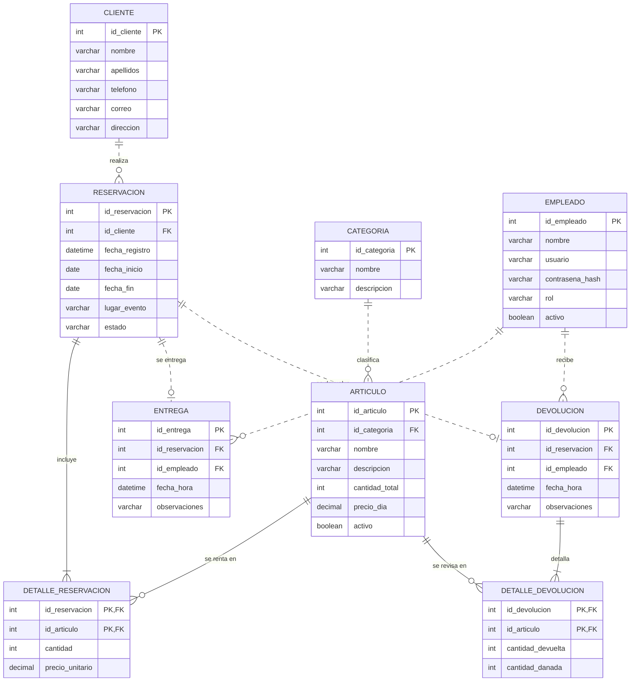

# DER en Mermaid (fuente editable)

GitHub dibuja este diagrama automáticamente.

```mermaid
erDiagram
    CLIENTE ||..o{ RESERVACION : "realiza"
    CATEGORIA ||..o{ ARTICULO : "clasifica"
    RESERVACION ||--|{ DETALLE_RESERVACION : "incluye"
    ARTICULO ||--o{ DETALLE_RESERVACION : "se renta en"
    RESERVACION ||..o| ENTREGA : "se entrega"
    RESERVACION ||..o| DEVOLUCION : "se devuelve"
    EMPLEADO ||..o{ ENTREGA : "registra"
    EMPLEADO ||..o{ DEVOLUCION : "recibe"
    DEVOLUCION ||--|{ DETALLE_DEVOLUCION : "detalla"
    ARTICULO ||--o{ DETALLE_DEVOLUCION : "se revisa en"
    CATEGORIA {
        int id_categoria PK
        varchar nombre 
        varchar descripcion
    }
    CLIENTE {
        int id_cliente PK
        varchar nombre
        varchar apellidos
        varchar telefono
        varchar correo 
        varchar direccion
    }
    EMPLEADO {
        int id_empleado PK
        varchar nombre
        varchar usuario 
        varchar contrasena_hash
        varchar rol
        boolean activo
    }
    ARTICULO {
        int id_articulo PK
        int id_categoria FK
        varchar nombre
        varchar descripcion
        int cantidad_total
        decimal precio_dia
        boolean activo
    }
    RESERVACION {
        int id_reservacion PK
        int id_cliente FK
        datetime fecha_registro
        date fecha_inicio
        date fecha_fin
        varchar lugar_evento
        varchar estado
    }
    DETALLE_RESERVACION {
        int id_reservacion PK,FK
        int id_articulo PK,FK
        int cantidad
        decimal precio_unitario
    }
    ENTREGA {
        int id_entrega PK
        int id_reservacion FK
        int id_empleado FK
        datetime fecha_hora
        varchar observaciones
    }
    DEVOLUCION {
        int id_devolucion PK
        int id_reservacion FK
        int id_empleado FK
        datetime fecha_hora
        varchar observaciones
    }
    DETALLE_DEVOLUCION {
        int id_devolucion PK,FK
        int id_articulo PK,FK
        int cantidad_devuelta
        int cantidad_danada
    }
```
